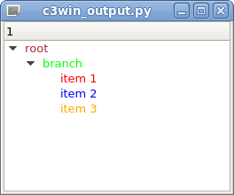

# simple-view
Step 3 - Parser generator written in Python

## Simple translation from C-- to Python

```
python view.py
```

Menu Tutorial, menu item "cecko3.g Python Qt"

### Input

```c++
// #include "QApplication"
// #include "QWidget"
// #include "QPushButton"
// #include "QMainWindow"
// #include "QTreeWidget"
// #include "QTreeWidgetItem"

int main () /* (int argc, char * * argv) */
{
     dcl QApplication * appl = new QApplication (sys.argv); /* (argc, argc) */

     if (false)
     {
        dcl QWidget * window = new QWidget ();
        window->resize (320, 240);
        window->show ();

        dcl QPushButton * button = new QPushButton ("Press me", window);
        button->move (100, 100);
        button->show ();
     }
     else
     {
        dcl QMainWindow * window = new QMainWindow ();

        dcl QTreeWidget * tree = new QTreeWidget ();

        dcl QTreeWidgetItem * root = new QTreeWidgetItem ();
        root->setText (0, "root");
        root->setForeground (0, QColor ("brown"));
        tree->addTopLevelItem (root);

        dcl QTreeWidgetItem * branch = new QTreeWidgetItem ();
        branch->setText (0, "branch");
        branch->setForeground (0, QColor ("lime"));
        root->addChild (branch);

        dcl int i;
        for (i = 1; i <= 3; i ++)
        {
           dcl QTreeWidgetItem * item = new QTreeWidgetItem ();
           item->setText (0, "item " + str (i));
           dcl QString color_name = " "; // !?
           if (i == 1)
              color_name = "red";
           else if (i == 2)
              color_name = "blue";
           else if (i == 3)
              color_name = "orange";
           dcl QColor color;
           color = QColor (color_name);
           item->setForeground (0, color);
           branch->addChild (item);
        }

        tree->expandAll ();
        window->setCentralWidget (tree);
        window->show ();
     }

     appl->exec_ (); /* appl->exec (); */
}
```

### Output




```python
#!/usr/bin/env python

import sys
try :
   from PyQt5.QtCore import *
   from PyQt5.QtGui import *
   from PyQt5.QtWidgets import *
except :
   from PyQt4.QtCore import *
   from PyQt4.QtGui import *

def main () :
      appl = QApplication (sys.argv)
      if False :
            window = QWidget ()
            window.resize (320, 240)
            window.show ()
            button = QPushButton ("Press me", window)
            button.move (100, 100)
            button.show ()
      else :
            window = QMainWindow ()
            tree = QTreeWidget ()
            root = QTreeWidgetItem ()
            root.setText (0, "root")
            root.setForeground (0, QColor ("brown"))
            tree.addTopLevelItem (root)
            branch = QTreeWidgetItem ()
            branch.setText (0, "branch")
            branch.setForeground (0, QColor ("lime"))
            root.addChild (branch)
            i = None
            i = 1
            while i <= 3 :
                  item = QTreeWidgetItem ()
                  item.setText (0, "item " + str (i))
                  color_name = ""
                  if i == 1 :
                     color_name = "red"
                  else :
                     if i == 2 :
                        color_name = "blue"
                     else :
                        if i == 3 :
                           color_name = "orange"
                  color = None
                  color = QColor (color_name)
                  item.setForeground (0, color)
                  branch.addChild (item)
                  i = i + 1
            tree.expandAll ()
            window.setCentralWidget (tree)
            window.show ()
      appl.exec_ ()

if __name__ == '__main__' :
   main ()
```

## Class Declarations


## Abstract syntax tree


